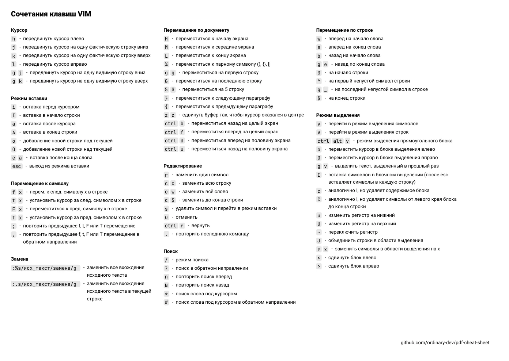

# PDF cheat sheet generator

This is a program for generating cheat sheets for keyboard shortcuts of various programs.



You can describe the available keyboard shortcuts in the toml file and get a PDF file as an output.

New cheat sheets are welcome.

## Getting started

Required programs: ruby, bundler.

```shell
bundle install
bundle exec main.rb -t templates/vim-ru.toml -o output.pdf
```

## Available cheat sheets

- Vim (ru)
